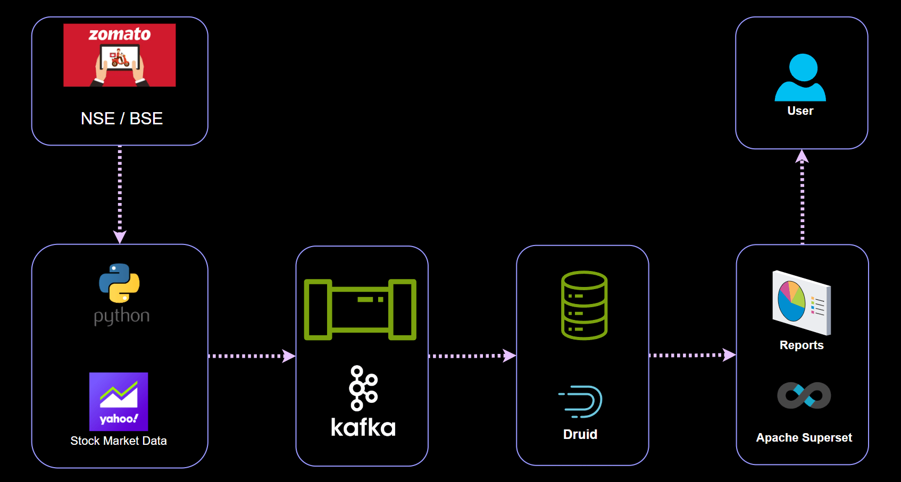

# Visualizing stock market data in realtime using Apache Kafka, Apache Druid and Apache Superset

In this project we are analyzing [Zomato's i.e. ZOMATO.NS](https://finance.yahoo.com/quote/ZOMATO.NS/) chart in real time using Apache Superset. To get real time data we are using Yahoo Finance's python API which is known as [yfinance](https://pypi.org/project/yfinance/). 

## Implementation

We have divided this project into 4 small parts and videos for each part will be published individually. These parts are as follows.

1. Phase 1: Pulling data from yfinance python api and preprocessing
1. Phase 2: Getting Apache kafka ready and pushing the data into Kafka
1. Phase 3: Installing and setting up Apache Druid and consuming data from kafka
1. Phase 4: Getting data into Apache Superset and creating charts 

### Phase 1: Pulling data from yfinance python api and preprocessing

### Phase 2: Installing and setting up kafka and push yfinance data into Kafka

To install and set-up Apache kafka please refer to documentation available at [atwish.org/apache-kafka/installation](https://atwish.org/apache-kafka/installation)

### Phase 3: Installing and setting up Apache druid and consuming data from Kafka

To Install and set-up Apache Druid please refer to documentation available at [atwish.org/apache-druid/installation](https://atwish.org/apache-druid/installation)

### Phase 4: Getting data into Apache Superset and Creating charts

To Install and set-up Apache Superset please refer to documentation available at [atwish.org/apache-superset/installation](https://atwish.org/apache-superset/installation)

> [!INFO]
> In Next Project we will consume this data into Apache Spark and perform Further analysis. If you are interested subscribe here.